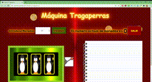

# Maquina Tragaperras

Este es un proyecto que hice para la asignatura de Entorno Cliente del FP de Desarrollo de Aplicaciones Web de Ilerna.
Está hecho con HTML, CSS, JavaScript.

¡¡ Espero que te divierta!!

;

## Funcionalidad de la Máquina:

1. Hay un control sobre las monedas introducidas
2. Palanca para mostrar la tirada aleatoria
3. Tres pantallas para mostrar el resultado de la tirada
4. Un historial para mostrar el gasto y adquisición de las monedas.

## Ganancias:

- Si sale una moneda, se gana 1 moneda.
- Si salen dos monedas, se ganan 4 monedas.
  -Si salen tres monedas, se ganan 10 monedas.
- Si salen dos hortalizas o frutas iguales, se ganan 2 monedas.
- Si salen tres hortalizas o frutas iguales, se ganan 5 monedas.
- Si sale una moneda y dos hortalizas o frutas iguales, se ganan 3 monedas.

## Construido con 🛠️️

&nbsp;

&nbsp;
&nbsp; &nbsp;

&nbsp; &nbsp;

&nbsp;

## Autor ✒️

:heart: Samantha Salinero [Github](https://github.com/sasalinero)

## Contacto 📱

<a href="https://www.linkedin.com/in/samantha-salinero/" target="about_blank">Linkedin</a>
